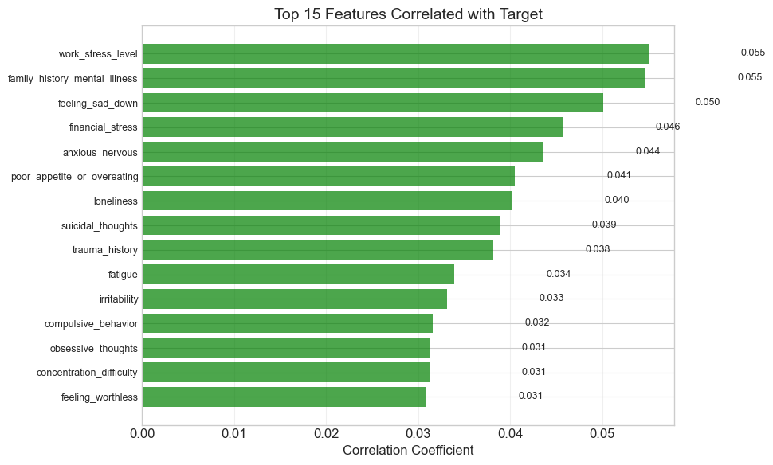
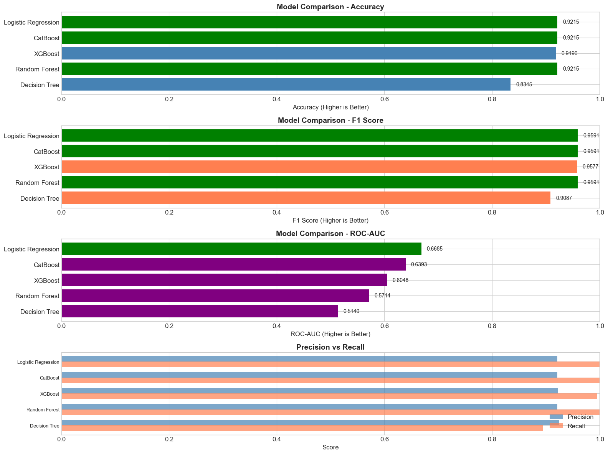

## Mental Health & Lifestyle – Risk Prediction Project

This project analyzes how lifestyle, work, and social factors are related to mental health issues and builds a machine learning model that **predicts whether a person is likely to have a mental health issue**.

The project is structured and documented to satisfy the course requirements (EDA, multiple models with tuning, scripts, web service, Docker, and deployment instructions).


---

## Problem Description

Modern lifestyle and work conditions strongly affect mental health, but it is often unclear **which concrete factors are most important** and **who is at higher risk**.  
In this project we use a survey-style dataset with demographic, work, lifestyle and mental-health–related questions to:

- **Predict** whether a person has a mental health issue (`Has_Mental_Health_Issue` – target variable)
- **Understand** which features (stress, sleep, workload, support, etc.) are the most important drivers
- **Provide a simple API** that can be used to obtain predictions for new records

### Target and Business Use

> **Goal**: Given a person’s characteristics and lifestyle indicators, predict the probability that they have a mental health issue.

Potential uses:

- **HR / People teams** – identify groups with higher risk and adjust workload, benefits, and support programs
- **Well-being products / apps** – provide early screening and recommend interventions
- **Researchers / analysts** – study associations between lifestyle and mental health

**Task type**: Binary classification  
**Target column**: `Has_Mental_Health_Issue` (0 = no, 1 = yes)  
**Main metric**: ROC AUC (plus accuracy, precision, recall)

**Models trained**: 
- Logistic Regression (baseline with tuning)
- Random Forest (with hyperparameter tuning)
- XGBoost (with hyperparameter tuning)

The best performing model based on validation ROC-AUC is automatically selected and saved.

---

## Dataset

- File: `data/mental_health.csv` (already committed to this repository)
- Each row represents one survey respondent.

### Column Examples

The dataset contains 50+ features. Some key groups:

- **Demographics**: `Age`, `Gender`, `Country`, `Education`, `Marital_Status`, `Income_Level`
- **Work & stress**:  
  `Employment_Status`, `Work_Hours_Per_Week`, `Remote_Work`,  
  `Job_Satisfaction`, `Work_Stress_Level`, `Work_Life_Balance`,  
  `Ever_Bullied_At_Work`, `Company_Mental_Health_Support`
- **Lifestyle**:  
  `Exercise_Per_Week`, `Sleep_Hours_Night`, `Caffeine_Drinks_Day`,  
  `Alcohol_Frequency`, `Smoking`, `Screen_Time_Hours_Day`,  
  `Social_Media_Hours_Day`, `Hobby_Time_Hours_Week`, `Diet_Quality`
- **Mental health indicators & history**:  
  `Feeling_Sad_Down`, `Loss_Of_Interest`, `Anxious_Nervous`,  
  `Panic_Attacks`, `Family_History_Mental_Illness`,  
  `Previously_Diagnosed`, `Ever_Sought_Treatment`, `On_Therapy_Now`,  
  `On_Medication`, `Trauma_History`, `Social_Support`, `Loneliness`,  
  `Discuss_Mental_Health`
- **Target**: `Has_Mental_Health_Issue` (0 or 1)

The data is small enough to work comfortably in a notebook, but large enough for meaningful modeling.

---

## Project Structure

```text
mental-health-lifestyle/
│
├── data/
│   └── mental_health.csv        # Dataset used in the project
│
├── notebook.ipynb              # EDA, feature analysis, and model development
│
├── train.py                    # Training script: trains multiple models (LR, RF, XGBoost), tuning, saves best
├── serve.py                    # Flask web service for predictions (/health, /predict)
├── predict.py                  # Standalone prediction script (CLI usage)
├── test_api.py                 # API testing script with examples
├── deploy.py                   # Deployment script for Docker, AWS, Railway
│
├── model.bin                   # Saved model + vectorizer (created after running train.py)
│
├── requirements.txt            # Python dependencies
├── Dockerfile                  # Container for the prediction service
└── README.md                   # This file
```

> Note: `model.bin` is created after you run `train.py` for the first time.

---

## EDA and Modeling (Summary)

The full analysis is in `notebook.ipynb`. Main steps:

- **Data preparation & cleaning**
  - Load `data/mental_health.csv`
  - Check missing values and handle them (simple imputation for numeric; separate category for missing in categoricals)
  - Cast `Has_Mental_Health_Issue` to integer 0/1
- **EDA**
  - Distribution of key numeric features: `Age`, `Work_Stress_Level`, `Sleep_Hours_Night`, `Work_Hours_Per_Week`, etc.
  - Analysis of target variable: class balance of `Has_Mental_Health_Issue`
  - Relationships between target and important drivers (e.g. stress level, sleep, loneliness, social support)
  - Correlation / feature importance using tree-based models

  

- **Models & tuning**
  - Model 1: **Logistic Regression** with hyperparameter tuning (C, class_weight)
  - Model 2: **Random Forest** with hyperparameter tuning (n_estimators, max_depth, min_samples, etc.)
  - Model 3: **XGBoost** with hyperparameter tuning (learning_rate, max_depth, subsample, etc.)
  - All models use **RandomizedSearchCV** with 5-fold cross-validation
  - Model selection based on **ROC AUC** on validation data
  - The **best model** is automatically selected and saved to `model.bin` with DictVectorizer

---

## How to Run Locally (without Docker)

### 1. Clone the repository

```bash
git clone git@github.com:oleksiyo/mental-health-lifestyle.git
cd mental-health-lifestyle
```

### 2. Create and activate virtual environment

On **Windows PowerShell**:

```bash
python -m venv venv
.\venv\Scripts\activate
```

On **macOS / Linux**:

```bash
python3 -m venv venv
source venv/bin/activate
```

### 3. Install dependencies

```bash
pip install --upgrade pip
pip install -r requirements.txt
```

### 4. Train the model

```bash
python train.py
```

After success, you should see `model.bin` in the root folder.

### 5. Run the prediction web service

Start the Flask service:

```bash
python serve.py
```

By default, the service listens on `http://0.0.0.0:9696`.

#### Health check

Open in browser or with `curl`:

```bash
curl http://localhost:9696/health
```

Expected response:

```json
{ "status": "ok" }
```

#### Example prediction request

`POST /predict` expects a JSON object with a set of features used during training  
(demographic, work and lifestyle fields).

Example:

```bash
curl -X POST "http://localhost:9696/predict" ^
     -H "Content-Type: application/json" ^
     -d "{
           \"Age\": 32,
           \"Gender\": \"Female\",
           \"Country\": \"Germany\",
           \"Education\": \"Bachelor\",
           \"Marital_Status\": \"Single\",
           \"Income_Level\": \"Middle\",
           \"Employment_Status\": \"Full-time\",
           \"Work_Hours_Per_Week\": 40,
           \"Remote_Work\": \"Hybrid\",
           \"Job_Satisfaction\": 6,
           \"Work_Stress_Level\": 7,
           \"Work_Life_Balance\": 5,
           \"Exercise_Per_Week\": \"1-2 times\",
           \"Sleep_Hours_Night\": 7.0,
           \"Caffeine_Drinks_Day\": 2,
           \"Alcohol_Frequency\": \"Rarely\",
           \"Smoking\": \"Never\",
           \"Screen_Time_Hours_Day\": 6.0,
           \"Social_Support\": 7,
           \"Loneliness\": 3,
           \"Discuss_Mental_Health\": \"Sometimes\"
         }"
```

Example JSON response:

```json
{
  "prediction": 0,
  "probability": 0.31
}
```

Where:
- **`prediction`** – model prediction (1 = likely mental health issue, 0 = unlikely)
- **`probability`** – predicted probability for class `1`

### 6. Test the API

You can test the API with the provided test script:

```bash
python test_api.py
```

This will run health checks and test predictions with sample data.

---

## Docker

The project includes a `Dockerfile` so the service can be containerized.

### Build the image

From the project root:

```bash
docker build -t mental-health-api .
```

### Run the container

```bash
docker run -it --rm -p 9696:9696 mental-health-api
```

Now the same endpoints are available:

- Health: `http://localhost:9696/health`
- Prediction: `http://localhost:9696/predict`

You can test with `python test_api.py` or use the curl examples above.

---

## Automated Deployment

Use the provided deployment script for easy deployment to various platforms:

```bash
python deploy.py
```

This interactive script provides options for:

1. **Local Docker** - Build and run locally
2. **AWS ECR + ECS** - Deploy to Amazon Web Services
3. **Railway** - Deploy to Railway PaaS
4. **Instructions** - View deployment guides for other platforms

### Manual Deployment Options

```bash
docker run -it --rm -p 9696:9696 mental-health-api
```

Now the same endpoints are available:

- Health: `http://localhost:9696/health`
- Prediction: `http://localhost:9696/predict`

You can reuse the same `curl` example from the previous section.

---

## Cloud Deployment

### Option 1: Using deploy.py (Recommended)

The easiest way to deploy is using the provided deployment script:

```bash
python deploy.py
```

Select from the menu:
- **AWS ECR/ECS** - Automated deployment to AWS (requires AWS CLI configured)
- **Railway** - Simple PaaS deployment (requires Railway CLI)
- **View instructions** - Manual deployment guides

### Option 2: AWS (Manual)

**Step 1: Build and push to ECR**
```bash
# Authenticate to ECR
aws ecr get-login-password --region us-east-1 | docker login --username AWS --password-stdin <ACCOUNT_ID>.dkr.ecr.us-east-1.amazonaws.com

# Create repository
aws ecr create-repository --repository-name mental-health-api --region us-east-1

# Build and push
docker build -t mental-health-api .
docker tag mental-health-api:latest <ACCOUNT_ID>.dkr.ecr.us-east-1.amazonaws.com/mental-health-api:latest
docker push <ACCOUNT_ID>.dkr.ecr.us-east-1.amazonaws.com/mental-health-api:latest
```

**Step 2: Deploy with App Runner (simplest)**
```bash
aws apprunner create-service \
  --service-name mental-health-api \
  --source-configuration "ImageRepository={ImageIdentifier=<ACCOUNT_ID>.dkr.ecr.us-east-1.amazonaws.com/mental-health-api:latest,ImageRepositoryType=ECR}"
```

Or use **ECS Fargate** for more control (create task definition, service, and load balancer).

### Option 3: Railway (Simplest)

```bash
# Install Railway CLI
npm install -g @railway/cli

# Login and deploy
railway login
railway init
railway up
```

Get your URL: `railway open`

### Option 4: Other Platforms

**Render** (via GitHub):
1. Connect repository
2. Select "Docker" as environment
3. Set port to 9696
4. Deploy

**Fly.io**:
```bash
fly launch  # Auto-detects Dockerfile
fly deploy
```

**Google Cloud Run**:
```bash
gcloud run deploy mental-health-api --source . --port 9696 --allow-unauthenticated
```

---

## Testing Deployed Service

After deployment, test your service:

```bash
# Update API_URL in test_api.py to your deployed URL
# For example: API_URL = "https://your-service.railway.app"

python test_api.py
```

Or use curl:

```bash
curl -X POST "https://your-service-url/predict" \
  -H "Content-Type: application/json" \
  -d '{"Age": 34, "Gender": "Male", "Work_Stress_Level": 8, ...}'
```

---


##  Next Steps & Future Improvements

- **Add more models**: Try CatBoost, LightGBM, or ensemble methods (Stacking, Voting)
- **Cross-validation**: Use StratifiedKFold for more robust validation
- **Input validation**: Add Pydantic models for request validation
- **Async support**: Migrate to FastAPI for better async handling
- **Kubernetes**: Deploy with Kubernetes for better scalability

---